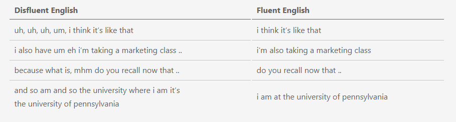
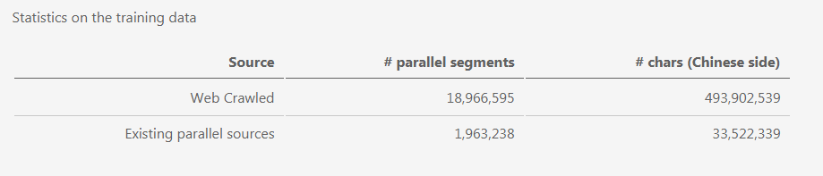

# IWSLT 2020

http://www.iwslt.org/doku.php?id=simultaneous_translation

## 1 Simultaneous Speech Translation

-   解决方案
    -   asr/mt
    -   end2end
-   评估方式
    -   translation quality , BLEU, TER, Chrf
    -   translation latency, average propotion (AP), average lagging (AL), 
-   训练数据
    -   
-   提交
    -   docker
    -   https://github.com/pytorch/fairseq/tree/simulastsharedtask/examples/simultaneous_translation

## 2 Video Speech Translation

-   数据
-   汉英，英俄
-   

## 3 Offline Speech Translation

-   解决方案
    -   asr/mt 级联
    -   end2end  比级联方案-1.5BLEU
-   数据
    -   有自动工具分段
    -   音频文件未分段

## 4 Conversational Speech Translation

-   Disfluent Conversational Speech
    -   Conversational speech has many artifacts not present in written text, including disfluencies (*hesitations*, *repetitions*, *self-corrections*, ..) and differences in grammar:
    -   

## 5 Open Domain Translation

-   two tasks

    -   Japanese-to-Chinese MT
    -   Chinese-to-Japanese MT

-   data

    -   Format of the files being released:

        1.  web_crawled_parallel_filtered.tar.gz : 3 files (zh, ja, domains) of the sentences that we obtained from crawling the Web, aligning and filtering.
        2.  existing_parallel.tar.gz : 3 files (zh, ja, domains) of the sentences that we obtained from curating existing Japanese-Chinese parallel datasets.
        3.  web_crawled_parallel_unfiltered.tar.gz - 3 files (zh, ja, domains) of the pre-filtered sentences.
        4.  web_crawled_unaligned.tar.gz - 2 files (zh, ja) of the scraped text with the document boundaries.

        **Please note**: Getting access to data, requires registration to the shared task on the CodaLab platform (link below)

    -   

-   submit url
    -   https://competitions.codalab.org/competitions/21430#learn_the_details
    -   287546756@qq.com

## 6 Non-Native Speech Translation

